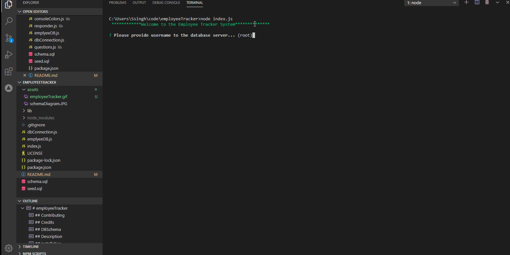
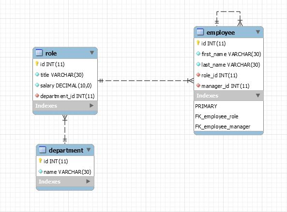

# employeeTracker

A command line employee management tool

## Table of Contents

- [Description](#Description)
- [Installation](#Installation)
- [Usage](#Usage)
- [Database Schema](#DBSchema)
- [Credits](#Credits)
- [License](#License)
- [Contributing](#Contributing)
- [Tests](#Tests)
- [Questions](#Questions)

## Description

A command line tool to manage employee records. It allows the user to create new role, department, and employees. It also allows the user to update the created record using various prompts. The user can also view the created data.
The tool uses MYSQL in the backend so the data created and updatd is persistent. Please view the schema.sql file in the project's root directory to know more about the database structure.

## Installation

- Set Up MySQL server
- Run Schema.sql file on MySQL Workbench to create the DB. This should create employeeTracker database.
- Optionally, run seed.sql
- run <code>npm install</code>
- run <code>node ./index.js</code>

## Usage

- Run <code>node./index.js</code> or <code>npm start</code> and follow the prompts on your screen.
  Note: The first prompt you recieve will ask for the database server username and password. Please fill in these values. This is
  required to connect to the database you creared by running schema.sql.

## DBSchema

There are only three tables in the database. The below diagram shows the relationship between these tables -

## Credits

sandyboon(https://github.com/sandyboon)

## License

Licensed under the MIT license.

## Contributing

Contribution to this project is not permitted at this moment.

## Tests

There are no tests at this moment.

## Questions

### Email : sandy.boon@gmail.com
